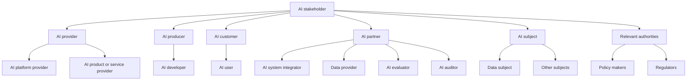

The following are my notes from a
## Guidance in laws / standards
 - [ISO 42001](https://www.iso.org/standard/81230.html) - ISO standard for AI safety - [[Learning/2025-03-30/ISO42001-Summary|Summary]]  
 - [EU AI Act](https://artificialintelligenceact.eu/) - EU act for AI safety - [[Learning/2025-03-30/EU-AI-Act-Summary|Summary]]  

### What is AI?
AI is anything that would customarily need human intelligence to complete the action that can be completed by machines. Industrial revolution?

### What does it mean for AI to be responsible?
AI that is innovative, trustworthy and respects human rights and democratic values.
Dimensions defining guidance may be specific to an organization and its problems.
Broadly, this is about doing the right thing, but also about safe/secure/trustworthy systems and results.
For a delivered system using AI agents it is important to monitor perf metrics to ensure compliance over time.

Unintended harm examples:
- Waymo self driving accident with cyclist
- Recidivism expectations set with racial bias
- AI chatbots producing harmful
- Google image search with image bias
- Gender and skin type bias
- Essentially, bias is hard and if you systematize trained on biased data.
- Also, a machines incorrect action is an organizational risk vs an individual who is responsible to their own actions to a point

Risk dimensions: 
- Fairness - Group bias
- Explainability - Easy to have tooling gaps
- Controllability - Not consistently following instructions, system intent
- Privacy & Security - Revealing data incorrectly. Integrity of system.
- Safety - Creating system misuse opportunities. Tell a user how to build explosives.
- Transparency - Misleading / obscuring reasons for outcomes in a way that doesn't allow stakeholders to make good decisions.
- Governance - Incorporating / adhering to best practices
- Veracity & Robustness - Generating incorrect content - hallucinating
- Could expect: Sustainability / Env impact / Human rights - general, not specific to AI

Risk is measure by: `measure of an event’s probability of occurring X magnitude or degree of the consequences`

There are two aspects to risk: inherent risk and residual risk.
Which are essentially mitigated vs unmitigated measures of risk

Risk assessment is an inherently human centric activity. This reflects the best practice that all AI outcomes are best when human owned. Think Tesla FSD always having human fallback.

## AI stakeholders map 

### Risk evaluation matrix

All risks are assigned likelihood and severity which are then transformed to risk through the following matrix:

| Likelihood/Severity | Very low | Low      | Moderate | Major    | Extreme  |
| ------------------- | -------- | -------- | -------- | -------- | -------- |
| Frequent            | Low      | Medium   | High     | Critical | Critical |
| Likely              | Very Low | Low      | Medium   | High     | Critical |
| Possible            | Very Low | Low      | Medium   | High     | Critical |
| Unlikely            | Very Low | Very Low | Low      | Medium   | High     |
| Highly unlikely     | Very Low | Very Low | Very Low | Low      | High     |

### Likelihood scale
Risk assessment will involve representative from all stakeholder groups

| Likelihood scale | Criteria                                                                            |
| ---------------- | ----------------------------------------------------------------------------------- |
| Frequent:        | Occurs more than 100 times a year; or probability is close to 100%.                 |
| Likely:          | Occurs between 10-100 times a year; or probability is between 50% to 99%.           |
| Possible:        | Occurs between 1-10 times a year; or probability is between 1% to 49%.              |
| Unlikely:        | Occurs less than 1x/year, but > once every 10 years; or probability is close to 1%. |
| Highly unlikely: | Occurs less than once every 10 years; or probability is close to 0%.                |

### Severity Scale

| Severity scale | Criteria                                                                                                          |
| -------------- | ----------------------------------------------------------------------------------------------------------------- |
| Very high:     | Persuasive, dangerous output results in irreversible negative outcome to the real world, including social impact. |
| High:          | Largely fabricated output results in substantial negative impact to the real world, including social impact.      |
| Moderate:      | Hallucinated output that leads to clear errors and degrades model performance and reliability in key tasks.       |
| Low:           | Hallucinations output causes minor errors but does not significantly alter model performance.                     |
| Very low:      | Minimal amount of hallucination in output that causes negligible impact on model performance.                     |

## Responsible AI Lifecycle stages
- Design - Define the business problem, evaluate the risk of potential solutions. Value vs risk. Review with diverse set of stakeholders
- Build - Train / test / evaluate - Training data selection salient to solution. Performant against target user population. Consent for model training use on training data? Delete data not needed to train the model
- Operate - Transparent to stakeholders on potential limitations. Monitor for model drift where model no longer represents current users/usage

## AI Dev policies
- Controllability: Having mechanisms to monitor and steer AI system behavior;
- Governance: Incorporating best practices into the AI supply chain, including providers and deployers;
- Privacy & Security: Appropriately obtaining, using and protecting data and models;
- Safety: Preventing harmful system output and misuse;
- Fairness: Considering impacts on different groups of stakeholders;
- Veracity & robustness: Achieving correct system outputs, even with unexpected or adversarial input;
- Explainability: Understanding and evaluating system outputs;
- Transparency: Enabling stakeholders to make informed choices about their engagement with an AI system;

Essentially this course is a primer on the governing bodies that are out there thinking about how to manage AI, then how to think through measuring and approaching/mitigating the risks of using AI. It intends to offer thought exercises so that the learner can think through their use-case critically, looking to highlight and mitigate risk at every step in the product lifecycle.

Related content:
- https://medium.com/@manavg/responsible-ai-risks-regulation-and-reality-6905d829f092